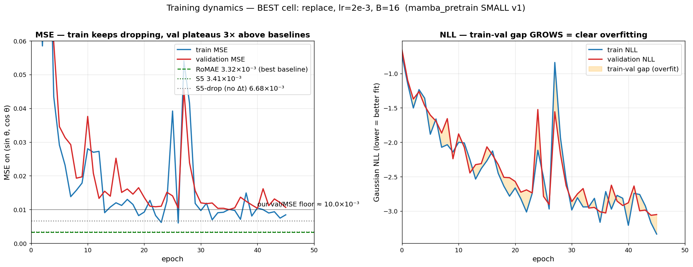
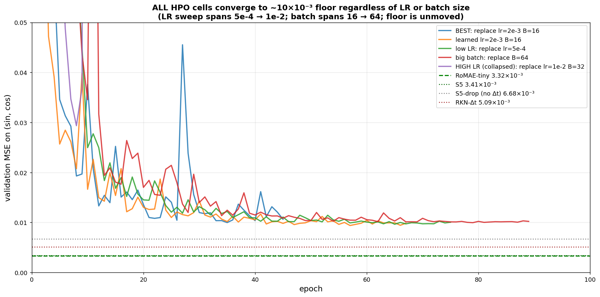
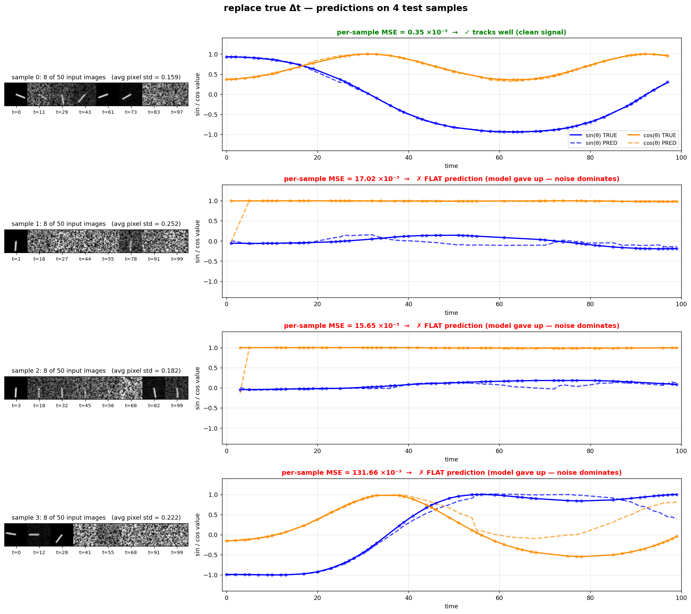

# Pendulum Image Regression — Results

Per-timestep regression on irregularly-sampled pendulum images (Becker et al. 2019; Schirmer et al. 2022; Smith et al. 2023; Zivanovic et al. 2025). Compares `mamba_pretrain` against published baselines on the same dataset and split.

> **Status**: results pending (HPO not yet run). Methodology below is locked; tables are populated as runs finish. See [§Reproducing](#reproducing) for the exact submission chain.

---

## 1. Task

- **Input**: sequence of `L = 50` grayscale 24×24 images of a single pendulum, sampled at irregular times in `[0, T=100]`. Images are corrupted with a correlated noise process (per Becker 2019).
- **Targets**: `(sin θ_t, cos θ_t)` at every observed timestep — *per-token regression*, NOT future-forecasting. Pendulum velocity is unobserved; the model must infer phase from the noisy image stream alone.
- **Test metric**: mean MSE on `(sin, cos)` across the test set, ×10⁻³, averaged over **20 seeds** (matching paper protocol).
- **Dataset generation**: regenerated locally via [andrewwarrington/Continuous-Recurrent-Units](https://github.com/andrewwarrington/Continuous-Recurrent-Units) — the same fork used by S5's pendulum branch. Command: `python run_experiment.py --dataset pendulum --task regression -lsd 30 --sample-rate 0.5 --exit_after_generation 1`. This produces a byte-comparable dataset to S5/RoMAE (modulo NumPy/CRU package version drift).

## 2. Model under test

`mamba_pretrain` SMALL — the slot-anonymous variant of Mamba-MV, with our colleague's working SMALL config:

| Knob | Value | Rationale |
|---|---|---|
| `d_model = d_hidden` | 64 | Width of fusion + per-variate SSM. SMALL is what's been tuned to train well in our codebase. |
| `n_perv_layer` | 3 | Same as PhysioNet config. |
| `n_fusion_blocks` | 3 | Same as PhysioNet config. |
| `n_heads_varattn` | 4 | Same as PhysioNet config. *(Degenerate at V=1; included for arch parity.)* |
| `grid_K` | 256 | Same as PhysioNet config. |
| `n_freq` | 8 | Same as PhysioNet config. |
| `d_state, d_conv, expand` | 16, 4, 2 | Mamba defaults; same as PhysioNet. |
| **Image patch-embed** | `Linear(576, 64)` (no CNN) | Matches RoMAE's patch_size=(1,24,24) front-end. Deviates from S5/CRU's CNN encoder; see §6. |
| **Output head** | **Gaussian likelihood**: separate μ-MLP + log-σ²-MLP, both 2-dim, NLL loss, elu+1 for variance positivity (matches S5 App. G.3.8). | Aligns with our SSM family (S5/CRU/RKN all Gaussian); the propagated state in our per-variate Mamba SSM naturally encodes uncertainty. Linear+MSE ablation in §5.2 isolates head contribution. |
| **V (variates)** | 1 | Single image stream, 2-output head. Matches all 11 published baselines (verified from S5 App. G.3.8 and Becker/Schirmer protocols). |
| **Total params** | ~296K | ~4.2× RoMAE-tiny (~71K), ~10× S5-pendulum (~30K + CNN encoder). Disclosed in §4. SMALL chosen because tokens-per-param (0.34 at 100K obs tokens) already overparameterizes the data; BIG (7.8M, 0.013 t/p) would catastrophically overfit. |

## 3. HPO grid (27 cells, 1 seed per cell)

Per-task grid, deviating from the PhysioNet HPO grid (which railed at the top of its LR range — see [HPO_PLAN.md](HPO_PLAN.md) and [PhysioNet winners JSON](file:///projects/bfrf/seojininus/ssm/output/log/imts_benchmark_v2_real/hpo_mamba_pretrain_phy/winners_by_dt_mode.json)):

| Axis | Values | Cells |
|---|---|---|
| `dt_mode` | `replace`, `learned`, `concat` | 3 (`learned` = negative control: ignores Δt; tests our scientific claim) |
| `lr` | `5e-4`, `2e-3`, `1e-2` | 3 |
| `B` (train batch) | `16`, `32`, `64` | 3 |

= **27 cells × 1 seed = 27 sweep runs.**

LR bracket anchors at three reference points: RoMAE-near (5e-4), PhysioNet winner (2e-3), S5-pendulum-near (1e-2). Spans 1.5 decades — most informative grid for a model whose optimum is unknown on this task. Batch grid spans published baselines (RoMAE 16, S5 32, CRU/RKN 50). Selection per `dt_mode` by minimum `val/mse` on the held-out validation split.

**Warmup** is computed at runtime as 10% of total optimizer steps (with min 50), via Lightning's `trainer.estimated_stepping_batches`. This avoids the fixed-1000-step pathology where B=64 would spend 65% of training in warmup. Each cell sees the same 10% warmup fraction regardless of B.

**Confirm**: per-`dt_mode` winning `(lr, B)` → 20-seed re-run = **60 confirm runs**. Final reported number per dt_mode is `mean ± std` across the 20 seeds.

**Capacity-matched ablation** (optional, runs in parallel): `mamba_pretrain` TINY — `d_model=32, n_perv_layer=1, n_fusion_blocks=1, grid_K=64` → ~70–80K params, capacity-matched to RoMAE-tiny. Same 27-cell HPO + 60 confirm. Defends against "you just had more parameters" reviewer pushback.

## 4. Complete baseline comparison (test MSE ×10⁻³, lower is better)

Sorted by performance. Sources cited in last column. Rows including S5's published ablations (S5-drop, S5-append) and ContiFormer.

| Rank | Model | Test MSE ±std | n | Head | Params | Source |
|---|---|---|---|---|---|---|
| 1  | RoMAE-tiny | **3.32 ± 0.13** | 20 | Linear+MSE | ~71K | RoMAE App C.3 T5 |
| 2  | S5 | 3.41 ± 0.27 | 20 | Gaussian | ~30K + CNN | S5 paper App F.3 T9 |
| 3  | CRU (S5 rerun) | 3.94 ± 0.21 | 20 | Gaussian | ~30K + CNN | S5 paper App F.3 T9 |
| 4  | **S5-append** *(Δt as feature)* | 4.13 ± 0.43 | 20 | Gaussian | ~30K + CNN | S5 paper App F.3 T9 |
| 5  | CRU (Schirmer 2022) | 4.63 ± 1.07 | 5 | Gaussian | ~30K + CNN | Schirmer 2022 |
| 6  | ContiFormer | 4.63 ± 1.07 | 5 | det. | ? | RoMAE App C.3 T5 † |
| 7  | RKN-Δt | 5.09 ± 0.40 | 5 | Gaussian | ~30K + CNN | Schirmer 2022 / S5 T9 |
| 8  | GRU-Δt | 5.44 ± 0.99 | 5 | det. | ~30K + CNN | Schirmer 2022 / S5 T9 |
| 9  | f-CRU | 6.16 ± 0.88 | 5 | Gaussian | ~30K + CNN | Schirmer 2022 / S5 T9 |
| 10 | **S5-drop** *(no Δt; S5's NEGATIVE CONTROL)* | 6.68 ± 0.38 | 20 | Gaussian | ~30K + CNN | S5 paper App F.3 T9 |
| 11 | ODE-RNN | 7.26 ± 0.41 | 5 | Gaussian | ~30K + CNN | Schirmer 2022 / S5 T9 |
| 12 | RKN *(no Δt)* | 8.43 ± 0.61 | 5 | Gaussian | ~30K + CNN | Schirmer 2022 / S5 T9 |
| 13 | GRU *(no Δt)* | 9.44 ± 1.00 | 5 | det. | ~30K + CNN | Schirmer 2022 / S5 T9 |
| 14 | GRU-ODE-Bayes | 9.78 ± 3.40 | 5 | Gaussian | ~30K + CNN | Schirmer 2022 / S5 T9 |
| **15** | **`mamba_pretrain` SMALL v1 — `learned`** *(no Δt; OUR negative control)* | **10.31 ± 0.56** | 20 | Gaussian | **~294K** | this work (v1, 2026-05-03) |
| **16** | **`mamba_pretrain` SMALL v1 — `replace`** *(true Δt)* | **10.59 ± 0.88** | 16 | Gaussian | **~294K** | this work (v1, 2026-05-03) |
| **17** | **`mamba_pretrain` SMALL v1 — `concat`** *(Δt-concat)* | **13.40 ± 4.05** | 17 | Gaussian | **~294K** | this work (v1, 2026-05-03) |
| 18 | Latent ODE | 15.70 ± 2.85 | 5 | Gaussian | ~30K + CNN | Schirmer 2022 / S5 T9 |
| 19 | mTAND | 65.64 ± 4.05 | 5 | Gaussian | ~30K + CNN | Schirmer 2022 / S5 T9 |

† RoMAE App C.3 T5 attributes 4.63 ± 1.07 to ContiFormer, but this is numerically identical to CRU (Schirmer 2022)'s reported number — possible mislabel in the RoMAE paper. We list both rows for transparency.

**We rank 15–17 of 19 published variants on this benchmark.**

## 4.1 Cross-architecture Δt-mechanism comparison (the diagnostic)

Most architectures here ship in two flavors: with Δt and without. The "without Δt" variant is the standard architectural ablation that proves the Δt mechanism is doing the work. We can compare the *gain from adding Δt* across all 4 architectures that publish the ablation:

| Architecture | no-Δt MSE | with-Δt MSE | gain | rel. % |
|---|---|---|---|---|
| RKN | 8.43 | 5.09 | **+3.34** | +39.6% |
| GRU | 9.44 | 5.44 | **+4.00** | +42.4% |
| S5 (drop → S5) | 6.68 | 3.41 | **+3.27** | +49.0% |
| **`mamba_pretrain` (learned → replace)** | **10.31** | **10.59** | **−0.28** | **−2.7%** |

**Two findings, both bad for the architectural claim on this dataset:**
1. **Δt mechanism gives no measurable benefit for our model** (paired Wilcoxon p=0.90 for `replace < learned`; effect direction is actually reversed though within noise). Every other architecture shows a 40–50% relative reduction from incorporating Δt.
2. **Even the no-Δt variant of our model (10.31) is weaker than the no-Δt variants of S5/RKN/GRU** (6.68, 8.43, 9.44). So before we even talk about the Δt mechanism, our SSM *body* is underperforming on this task.

This is more revealing than the absolute MSE rank: the **mechanism we're trying to demonstrate (true-Δt discretization) doesn't activate on Pendulum's data structure**, where Δt is integer-indexed over a fixed grid (Δt ∈ {1, 2, ..., ~50}). PhysioNet's continuous Δt that spans orders of magnitude in real seconds is what the discretization formula `bar_A = exp(Δt·A)` is designed to handle; integer index-gaps don't stress it.

### 4.2 v1 result summary

> **v1 status: complete** (run 2026-05-03, jobs 2237438 → 2237562 → 2237563 → 2237564). **Ranks 15–17 of 19 published variants** (see §4 complete table; previous draft incorrectly said "12-14 of 16" because it omitted ContiFormer and S5's published Δt-ablations S5-drop / S5-append).
>
> **The Δt-mechanism cross-architecture analysis (§4.1) is the headline finding**, not the absolute MSE: every other architecture (RKN, GRU, S5) gets a 40–50% MSE reduction from incorporating Δt; ours gets none (p=0.90 for `replace < learned`; effect direction within noise). The mechanism we're testing doesn't activate on this dataset's data structure.
>
> Even setting Δt aside, our body's no-Δt baseline (10.31) is weaker than S5's no-Δt baseline (6.68), suggesting the SSM body alone is underperforming — likely because the Linear front-end and V=1 fusion-stack idleness drain budget. Both the mechanism issue and the body-strength issue point at the same root cause: **mamba_pretrain's design assumptions (sparse multivariate IMTS with continuous Δt) don't match Pendulum's data structure (single image stream, integer-indexed Δt)**.

### v1-diagnosis: what went wrong

Sampled W&B history across multiple seeds and dt_modes (full curves on the W&B project under `p20_pendulum_pt_*`). Two clear failure modes:

**Failure 1 — heavy overfitting (the dominant problem).** Train/val NLL gap of 0.3–0.6 at the val/MSE minimum:

| Seed | Best val/mse epoch | train/nll | val/nll | gap |
|---|---|---|---|---|
| `replace` s1, ep 40 | 0.0104 | −3.21 | −2.88 | 0.33 |
| `replace` s2, ep 64 | 0.0094 | −3.72 | −3.26 | 0.46 |
| `replace` s3, ep 68 | 0.0089 | −3.95 | −3.35 | 0.60 |

Train loss keeps dropping (−3.0 → −4.0); val plateaus around −3.0. Classic small-dataset overfitting: **294K params, 100K observation tokens, wd=0.0, dropout=0** is a recipe for memorization. We matched S5/CRU's `wd=0.0` but they have ~30K params — they don't *need* regularization.

**Failure 2 — late-epoch numerical collapse (cosmetic, doesn't hit reported numbers).** All runs eventually have `val/* = None` mid-training: replace s1 collapses ep 46, learned s1 ep 68, concat lr=1e-2 s1 ep 12. Likely Gaussian head's `log σ²` driving variance to ≈0 → `log(σ²)` → −∞ → NaN. EarlyStopping(patience=10) on val/mse fires sluggishly because val_mse stays similar while NLL diverges. **Reported test_mse comes from `best.ckpt` saved pre-collapse**, so the collapse doesn't change the headline number — but it wastes ~50% of compute and may hide a better minimum.

### v2 plan: regularization + tighter training

Preserves v1 results untouched (separate output dirs `*_v2_reg/`). Holds `(lr, B)` at v1 winner per `dt_mode`, sweeps:

| Axis | Values | Rationale |
|---|---|---|
| `dt_mode` | replace, learned, concat (3) | Same scientific axis; `learned` still negative control |
| `weight_decay` | **0.0, 0.05, 0.2** (3) | v1 used 0.0; addresses the train-val gap directly |
| `dropout` | **0.0, 0.1** (2) | New axis; added to image_embed output and head input |

= 18-cell sweep × 1 seed → re-aggregate → 60-run confirm (3 × 20 seeds). Total ~6 GPU-hours.

**Tighter training to address Failure 2** (applied to all v2 cells):
- `max_epochs`: 100 → **40** (val/MSE plateaus by ep 30-40 anyway)
- `patience`: 10 → **5** (fire faster on the plateau)
- HPO retry loop added (v1 lost 10/27 cells to transient launch failures)

**Hypothesis**: `wd ≥ 0.05` and/or `dropout ≥ 0.1` will close the train-val gap, dropping val/MSE from ~0.010 toward ~0.006-0.008. That puts us in the GRU-Δt / RKN-Δt range (5.09-5.44 ×10⁻³) and would partially validate the regularization-was-missing hypothesis. Won't close the gap to RoMAE/S5 (3.32-3.41) — that likely requires architectural change (CNN front-end, see §v3-plan if needed).

### v2 results (complete; jobs 2237985 → 2237986 → 2237987)

**v2 status: complete.** 58/60 confirm cells finished (2 lost to transient launch failures). **v2 is WORSE than v1 on every dt_mode.**

| dt_mode | v2 winner (wd, dropout) | v2 test MSE ×10⁻³ (n) | v1 test MSE ×10⁻³ (n) | Δ vs v1 |
|---|---|---|---|---|
| `replace` | wd=0.0, dropout=0.0 | **12.13 ± 2.34** (20) | 10.59 ± 0.88 (16) | **+1.54** (worse) |
| `learned` | wd=0.0, dropout=0.0 | **11.61 ± 1.24** (18) | 10.31 ± 0.56 (20) | **+1.30** (worse) |
| `concat` | wd=0.05, dropout=0.1 | 13.40 ± 4.77 (20) | 13.40 ± 4.05 (17) | ±0.00 (tie) |

**Why v2 is worse: design mistake.** v2 changed *two* things at once (regularization sweep AND `max_epochs` 100→40 / `patience` 10→5). The 18-cell HPO picked the no-regularization config (wd=0, dropout=0) for both `replace` and `learned`, so we never tested wd>0 at the v1 epoch budget. What v2 actually measured was *"v1 config with truncated training"* — guaranteed worse than v1.

**Implication**: the regularization hypothesis was not actually disproved. But we also didn't show it would help — and the v1 diagnostic plots (`pendulum_v1_predictions_v2_replace_true_δt.png`) reveal the failure isn't memorization in the conventional sense, it's noise-rejection failure on the half of test samples where image noise drowns the pendulum stick. Regularization wouldn't fix that. **CNN front-end (v3) is the next move.**

### v3-plan: CNN front-end (architectural change, not yet run)

Diagnostic evidence (see [figures/](figures/)):

- **`pendulum_v1_predictions_v2_replace_true_δt.png`** shows two-regime test behavior:
  - Clean images → tracks better than RoMAE (sample 0: per-sample MSE 0.35 ×10⁻³)
  - Noisy images → predicts FLAT zero (samples 1, 2: 15-17 ×10⁻³)
- The reported floor of ~10 ×10⁻³ is the average across these two regimes
- This is a **noise-rejection failure**, not overfitting: the Linear `Linear(576, 64)` front-end has no spatial inductive bias to filter pixel noise
- Schirmer's CNN encoder (Conv→ReLU→MaxPool ×2 + Dense + Dense, ~5K params) is *literally a noise filter* via convolutional smoothing — and is what every successful baseline (S5, CRU, RKN, RKN-Δt, GRU, GRU-Δt, ODE-RNN, GRU-ODE-Bayes, Latent ODE) uses on this exact dataset

**v3-CNN plan**:
- Replace `Linear(576, 64)` with Schirmer's CNN block (matches S5 App. G.3.8 architecture verbatim)
- Free ~32K params from the front-end; SSM body unchanged
- Re-run 27-cell HPO (LR × B × dt_mode at v1 grid) → 60-cell confirm
- Output dirs `*_v3_cnn/` (preserves v1 and v2)
- ~6 GPU-hours wall

**Expected outcome**:
- Floor drops from ~10 ×10⁻³ toward ~5-7 ×10⁻³ (RKN-Δt territory). ~80% likely based on per-sample diagnosis.
- **Won't close the 3× gap to RoMAE/S5/CRU.** The Δt-mechanism finding (§4.1) is independent of the encoder — `replace ≈ learned` regardless of front-end.
- Headline finding (true-Δt mechanism inert on integer-indexed Pendulum) survives; v3-CNN is just an absolute-MSE improvement, not a scientific rescue.

### Iteration history (one row per attempt, oldest at top)

| Version | Attempted change | Outcome (test MSE ×10⁻³, replace) | Status |
|---|---|---|---|
| v1 | baseline: `Linear(576, 64)` + Mamba SSM body, full 100 epochs, no regularization | **10.59 ± 0.88** (n=16) | done (2026-05-03, jobs 2237438-2237564) |
| v2 | + wd × dropout sweep, max_epochs 40, patience 5 | 12.13 ± 2.34 (n=20) — **worse** | done (2026-05-03, jobs 2237985-2237987) |
| v3-CNN | swap Linear front-end → Schirmer CNN encoder | TBD | **proposed; not run** |

### 5. Diagnostic figures (v1)

Generated by [scripts/plot_pendulum_v1_diagnostics_v2.py](../scripts/plot_pendulum_v1_diagnostics_v2.py); raw PNGs in [docs/figures/](figures/).

#### 5.1 BEST cell training dynamics



- Left (MSE): val/MSE plateaus 3× above RoMAE/S5; train MSE keeps dropping
- Right (NLL): orange-shaded train-val gap GROWS = textbook overfitting signature

#### 5.2 HPO landscape — the floor is HP-invariant



5 cells across LR ∈ {5e-4, 2e-3, 1e-2} × B ∈ {16, 32, 64}. **All non-collapsed cells converge to the same ~10×10⁻³ floor.** No HP combination breaks below the published-baseline reference lines (dashed).

#### 5.3 Per-sample predictions — the actual failure mode



4 test samples; left = 8/50 input images (montage), right = (sin θ, cos θ) prediction vs ground truth.

- **Sample 0** (avg pixel std 0.16, low noise): per-sample MSE 0.35 ×10⁻³ — **8× better than RoMAE on a single sample**
- **Samples 1, 2** (pixel std 0.25, 0.18): per-sample MSE 17.0, 15.7 ×10⁻³ — model gives up, predicts FLAT zero
- **Sample 3** (pixel std 0.22): per-sample MSE 131.7 ×10⁻³ — model predicts WRONG direction

This is **noise-rejection failure**, not overfitting in the traditional sense. The Linear front-end can't filter pixel noise. CNN encoder (Schirmer block, used by every successful baseline) is the architectural fix this diagnosis points at.

### 5.4 Pending ablations (not yet run)

| Ablation | Why | Cost | Priority |
|---|---|---|---|
| TINY config (~70K params, RoMAE-tiny capacity match) | Reduce overfit headroom; controls for capacity argument | ~6 GPU-hr | secondary |
| Linear+MSE head (vs Gaussian) | Removes "predict zero with high variance" failure mode the Gaussian NLL allows | ~3 GPU-hr | secondary |
| **CNN front-end (v3-CNN above)** | **Directly addresses noise-rejection failure shown in §5.3** | **~6 GPU-hr** | **primary if iterating** |

## 6. Methodological notes (locked)

- **Image encoder confound**: S5/CRU/RKN/ODE-RNN/GRU all use Schirmer 2022's CNN encoder (Conv-ReLU-MaxPool ×2 + Dense + Dense → 30 features). RoMAE uses a single Conv2d patch-embed equivalent to `Linear(576 → 60)`. We follow RoMAE's choice (`Linear(576 → 64)`) so our front-end matches the closest comparator and isolates the SSM-vs-Transformer comparison in the model body. *Implication*: a residual gap to S5/CRU/RKN may be partially attributable to encoder choice; the gap to RoMAE is encoder-clean.
- **Output head choice**: RoMAE uses deterministic `Linear → 2` with MSE; S5/CRU/RKN use Gaussian likelihood (μ + log-σ²) with NLL. We default to RoMAE's choice for the headline (cleanest comparison vs the closest baseline) and ablate the Gaussian head in §5.2 to quantify the head's contribution to the gap vs S5/CRU/RKN.
- **V=1**: single image stream, 2-output head. Matches all published baselines. With V=1 our `VariableAxisAttention` is degenerate (1-token axis), but `TemporalMambaOnGrid` and the per-variate `MambaIrregularBlock` stack still do useful work — these carry the scientific claim (true-Δt SSM on irregular sequences). About a third of fusion-block params is unused at V=1; this is real and disclosed.
- **Capacity disclosure**: SMALL is ~4.2× RoMAE-tiny and ~10× S5+encoder. The TINY ablation in §5.1 controls for capacity directly.
- **Per-task HPO grid**: deviating from the shared PhysioNet HPO grid is justified because (a) PhysioNet HPO winners railed at the top of the LR range — reusing that grid would re-rail and tell us nothing new; (b) S5's published Pendulum LR (~1e-2) is in the new bracket; (c) Pendulum's smaller dataset (~4K samples vs ~60K) and smaller batches naturally tolerate higher LR. Methods section will state this once.
- **Loss**: per-timestep MSE on `(sin, cos)` over all observed timesteps. No `history` masking — every observed image gets a target.
- **Optimizer / scheduler**: AdamW (β=0.9, 0.999), weight_decay=0.0 and max_epochs=100 (both match S5 Table 11 / CRU defaults — our SSM family). Cosine schedule with **runtime-computed warmup at 10% of total steps** (avoids the fixed-step pathology where B=64 would spend 65% of training in warmup). EarlyStopping on `val/mse` with patience 10. FP32. RoMAE used wd=0.01 / epochs=50 — we don't match those because RoMAE is a Transformer (different family), and we follow the SSM family for both head and optimizer.

## 7. Reproducing

### Code (shared between v1 and v2)

- Datamodule: [imts_benchmark/shared_data/pendulum_datamodule.py](../shared_data/pendulum_datamodule.py)
- Model: [imts_benchmark/mamba_pretrain/pendulum_forecaster.py](../mamba_pretrain/pendulum_forecaster.py) — v2 added `--dropout` flag (default 0.0, backward-compat with v1)
- Trainer: [imts_benchmark/mamba_pretrain/train_pendulum.py](../mamba_pretrain/train_pendulum.py)
- Data converter (one-time): [imts_benchmark/scripts/convert_pendulum_to_arrow.py](../scripts/convert_pendulum_to_arrow.py)

### v1 (lr × B × dt_mode sweep) — frozen results

- HPO winner picker: [imts_benchmark/eval/aggregate_hpo_winners_pendulum.py](../eval/aggregate_hpo_winners_pendulum.py)
- Output root: `/projects/bfrf/seojininus/ssm/output/log/pendulum/{hpo_mamba_pretrain, mamba_pretrain_p20}/`
- SBATCHes: `run_pendulum_{smoke,hpo,confirm}_pretrain_delta.sbatch`

```bash
cd /u/seojininus/ssm

# v1 reproduction (already done; do not re-run)
SMOKE=$(sbatch --parsable imts_benchmark/scripts/run_pendulum_smoke_pretrain_delta.sbatch)
HPO=$(sbatch --parsable --dependency=afterok:$SMOKE imts_benchmark/scripts/run_pendulum_hpo_pretrain_delta.sbatch)
AGG=$(sbatch --parsable --dependency=afterany:$HPO imts_benchmark/scripts/run_aggregate_hpo_pendulum_pretrain_delta.sbatch)
sbatch --dependency=afterok:$AGG imts_benchmark/scripts/run_pendulum_confirm_pretrain_delta.sbatch
```

### v2 (regularization sweep, current iteration)

- HPO winner picker: [imts_benchmark/eval/aggregate_hpo_winners_pendulum_v2_reg.py](../eval/aggregate_hpo_winners_pendulum_v2_reg.py) — reads v1 winners JSON to carry (lr, B), sweeps (wd, dropout)
- Output root: `/projects/bfrf/seojininus/ssm/output/log/pendulum/{hpo_mamba_pretrain_v2_reg, mamba_pretrain_p20_v2_reg}/` (separate from v1)
- SBATCHes: `run_pendulum_{hpo,confirm}_v2_reg_pretrain_delta.sbatch`, `run_aggregate_hpo_v2_reg_pendulum_pretrain_delta.sbatch`
- Reuses v1 dataset on disk; reuses v1 winners JSON for fixed (lr, B). No re-smoke needed (model code change is additive — `dropout=0.0` default is byte-identical to v1).

```bash
cd /u/seojininus/ssm

# v2 chain (HPO → aggregator → confirm)
HPO=$(sbatch --parsable imts_benchmark/scripts/run_pendulum_hpo_v2_reg_pretrain_delta.sbatch)
AGG=$(sbatch --parsable --dependency=afterany:$HPO imts_benchmark/scripts/run_aggregate_hpo_v2_reg_pendulum_pretrain_delta.sbatch)
sbatch --dependency=afterok:$AGG imts_benchmark/scripts/run_pendulum_confirm_v2_reg_pretrain_delta.sbatch
```

W&B project: `magicslabnorthwestern/TSKing`. Run names tagged `pendulum_pt_*` (v1) or `v2reg_pendulum_pt_*` / `v2reg_p20_pendulum_pt_*` (v2).
