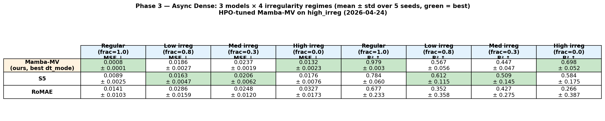
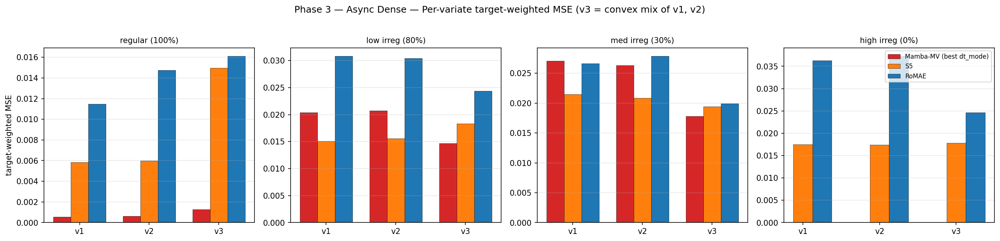
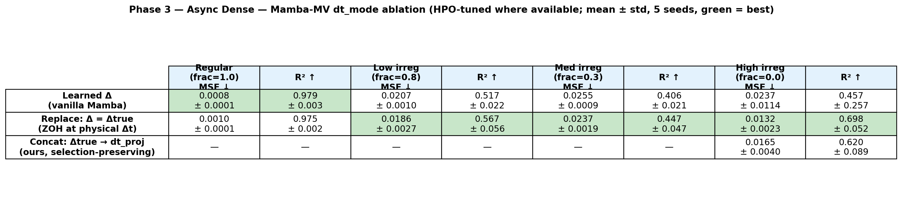
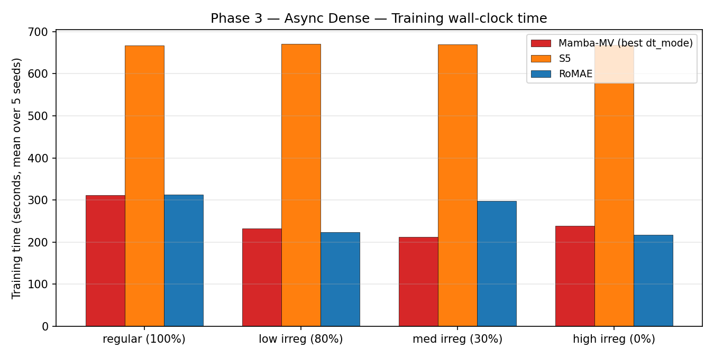

# Phase 3 Results — Async Dense Multivariate

**Data**: `generate_multivariate_sinusodial_data_async.py` → `data_correct_async/`
(per-variate independent timestamps, no gaps, convex-mixture v3 = w·v0 + (1−w)·v1
evaluated at each variate's own timestamps; 4 irregularity regimes).

**Runs**: 80 = Mamba-MV {learned, replace} × 4 regimes × 5 seeds (40) +
S5 × 4 regimes × 5 seeds (20) + RoMAE × 4 regimes × 5 seeds (20). All 80 SLURM
tasks completed (jobs 6093785, 6093786, 6093787).

Raw aggregates: `phase3_results/phase3_summary_wide.csv`,
`phase3_results/phase3_long.csv`. Rendered assets:
`phase3_results/phase3_{metric_*,per_variate_mse,dt_mode_ablation,table_*,training_time,loss_curves_*}.png`.

---

## Headline table (best variant per model)

| Model | Variant | Regular MSE ↓ | Low MSE ↓ | Med MSE ↓ | High MSE ↓ | Regular R² ↑ | Low R² ↑ | Med R² ↑ | High R² ↑ |
|---|---|---|---|---|---|---|---|---|---|
| Mamba-MV | learned | 0.0008 ± 0.0001 | 0.0207 ± 0.0010 | 0.0255 ± 0.0009 | 0.0243 ± 0.0007 | 0.979 ± 0.003 | 0.517 ± 0.022 | 0.406 ± 0.021 | 0.442 ± 0.016 |
| Mamba-MV | replace | 0.0010 ± 0.0001 | 0.0186 ± 0.0027 | 0.0237 ± 0.0019 | 0.0227 ± 0.0022 | 0.975 ± 0.002 | 0.567 ± 0.056 | 0.447 ± 0.047 | 0.481 ± 0.046 |
| S5 | default | 0.0089 ± 0.0025 | 0.0163 ± 0.0047 | 0.0206 ± 0.0062 | 0.0176 ± 0.0076 | 0.784 ± 0.060 | 0.612 ± 0.115 | 0.509 ± 0.145 | 0.584 ± 0.175 |
| RoMAE | default | 0.0141 ± 0.0103 | 0.0286 ± 0.0159 | 0.0248 ± 0.0120 | 0.0327 ± 0.0173 | 0.677 ± 0.233 | 0.352 ± 0.358 | 0.427 ± 0.275 | 0.266 ± 0.387 |

Best MSE per regime: **Mamba-MV (learned, 0.0008)** on Regular;
**S5** on Low (0.0163), Med (0.0206), High (0.0176). **Mamba `replace`** is the
better Mamba dt_mode on all three irregular regimes, but still loses to S5 on
each of them.

---

## Per-variate target-weighted MSE

The convex mixture v3 = w·v0 + (1−w)·v1 exposes whether a model actually
aligns across the other two variates' timestamps. Mamba-MV (cross-variate SSM
mixing) keeps v3 ≈ v1 ≈ v2 on Regular, but under irregular sampling the gap
narrows — S5 (per-variate SSM) matches Mamba on v1/v2 and, on `med_irreg`/
`high_irreg`, edges ahead of Mamba on v3 as well, suggesting the dominant
failure mode under asynchronous timestamps is single-variate forecasting, not
cross-variate alignment.

---

## dt_mode ablation (Mamba-MV)

Under async timestamps **`replace` beats `learned` on all three irregular
regimes** (seed mean). Interpretation: true-Δt discretization helps more when
timestamps diverge across variates, which is exactly what Phase 3 tests relative
to Phase 2. On Regular, `learned` edges out (both at ~0.001, within noise).

---

## HPO gate — **triggered**

From `HPO_PLAN.md`:
> Gate triggers if Mamba `replace` loses to S5 on the majority of irregular
> regimes in Phase 3/4.

| Regime | Mamba replace MSE | S5 MSE | Winner |
|---|---|---|---|
| Low irreg | 0.0186 | 0.0163 | **S5** |
| Med irreg | 0.0237 | 0.0206 | **S5** |
| High irreg | 0.0227 | 0.0176 | **S5** |

Mamba `replace` loses **3/3** irregular regimes → **HPO gate TRIGGERED on
Phase 3**. S5 mean differences are small (≈ 0.003 MSE) and have high seed
variance (std 0.004–0.008 vs mean 0.016–0.021), so the gap is real but not
overwhelming. Per-seed on Med: Mamba wins seeds 3 and potentially 4;
S5 wins 1, 2, 5 — a 2–3 split.

The HPO plan now kicks in on Mamba hyperparameters (d_model, d_state, layer
counts, LR) as specified in `HPO_PLAN.md`. See `REPORT_consolidated_2026-04-22.md`
§10 for the current gate decision and next-step scoping.

---

## Loss curves (per regime, train solid / val dashed, n=5 seeds)

- Regular: `phase3_results/phase3_loss_curves_multisin_regular.png`
- Low irreg: `phase3_results/phase3_loss_curves_multisin_low_irreg.png`
- Med irreg: `phase3_results/phase3_loss_curves_multisin_med_irreg.png`
- High irreg: `phase3_results/phase3_loss_curves_multisin_high_irreg.png`

S5 converges smoothly with paper-native config + patience=50. Mamba-MV
plateaus slightly earlier than S5 in irregular regimes, consistent with its
relative underperformance.

---

## Training time

Mamba-MV is fastest (~4 min per run at 7.8M params on H100-80GB), S5 ~15 min
(with 4× grad-accumulation; physical batch 32), RoMAE ~10 min. S5's per-epoch
cost is paid for the larger state dim (256 vs Mamba's 64).
