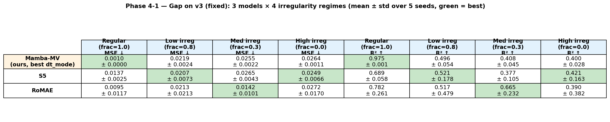
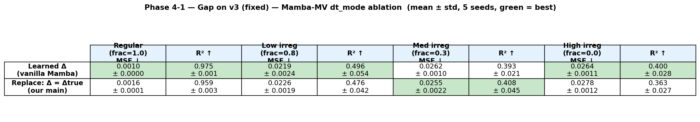
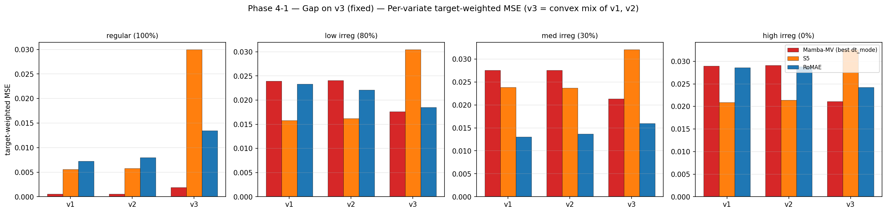
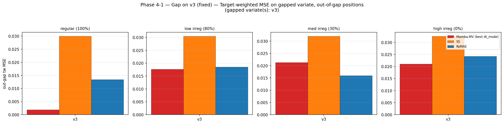
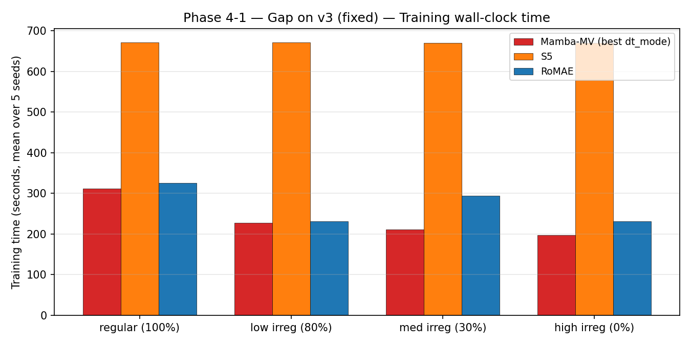

# Phase 4-1 Results — Async Dense + Gap on v3 (fixed)

**Data**: `generate_multivariate_sinusodial_data_gap.py --gap_variate_mode fixed_v3`
→ `data_correct_gap/`. One long forbidden interval (`gap_start ∈ [2.5, 6.0]`,
`gap_len ∈ [1.5, 3.0]`) drops all of v3's observations inside it. v0 and v1 stay
fully observed across the gap, so the model must infer v3 = w·v0 + (1−w)·v1 from
the two parts.

**Runs**: 80 = Mamba-MV {learned, replace} × 4 × 5 (40) + S5 × 4 × 5 (20) +
RoMAE × 4 × 5 (20). All completed (jobs 6093788, 6093789, 6093790).

Raw aggregates: `phase4_1_results/phase4_1_summary_wide.csv` / `phase4_1_long.csv`.

---

## Headline table

| Model | Variant | Regular MSE ↓ | Low MSE ↓ | Med MSE ↓ | High MSE ↓ | Regular R² ↑ | Low R² ↑ | Med R² ↑ | High R² ↑ |
|---|---|---|---|---|---|---|---|---|---|
| Mamba-MV | learned | 0.0010 ± 0.0000 | 0.0219 ± 0.0024 | 0.0262 ± 0.0010 | 0.0264 ± 0.0011 | 0.975 ± 0.001 | 0.496 ± 0.054 | 0.393 ± 0.021 | 0.400 ± 0.028 |
| Mamba-MV | replace | 0.0016 ± 0.0001 | 0.0226 ± 0.0019 | 0.0255 ± 0.0022 | 0.0278 ± 0.0012 | 0.959 ± 0.003 | 0.476 ± 0.042 | 0.408 ± 0.045 | 0.363 ± 0.027 |
| S5 | default | 0.0137 ± 0.0025 | 0.0207 ± 0.0073 | 0.0265 ± 0.0043 | 0.0249 ± 0.0066 | 0.689 ± 0.058 | 0.521 ± 0.178 | 0.377 ± 0.105 | 0.421 ± 0.163 |
| RoMAE | default | 0.0095 ± 0.0117 | 0.0213 ± 0.0213 | 0.0142 ± 0.0101 | 0.0272 ± 0.0170 | 0.782 ± 0.261 | 0.517 ± 0.479 | 0.665 ± 0.232 | 0.390 ± 0.382 |

Best per regime:
- Regular: **Mamba-MV learned (0.0010)** — 10× better than the next model, same as Phase 2/3.
- Low irreg: **S5 (0.0207)**, Mamba `learned` (0.0219) second.
- Med irreg: **RoMAE (0.0142)** — but RoMAE std = 0.010 (≈ 70% of mean), so one seed is an outlier; Mamba `replace` (0.0255) is the tighter runner-up.
- High irreg: **S5 (0.0249)**, Mamba `learned` (0.0264) second.

RoMAE is noisy — the per-seed std on Med is 0.010 (vs 0.001 for Mamba), meaning
at least one seed converged unusually well and dragged the mean down.
The seed-mean leader on High/Low is consistently S5 or Mamba `learned`.

---

## dt_mode ablation

In Phase 4-1 **`learned` edges `replace` on 3/4 regimes** (Regular, Low, High).
On Med the two are within 0.0007 MSE of each other. This inverts the Phase-3
ordering (where `replace` was clearly better under irregularity). Working
hypothesis: when v3 has a long absence, the per-step true Δt between
observations becomes large and spiky, and the `replace` mode's direct
substitution of Δ = Δtrue amplifies that noise; `learned` Δ is a smoothed
estimator and proves more robust to gap-induced Δ outliers.

---

## HPO gate — **triggered** (2/3)

| Regime | Mamba replace MSE | S5 MSE | Winner |
|---|---|---|---|
| Low irreg | 0.0226 | 0.0207 | **S5** |
| Med irreg | 0.0255 | 0.0265 | Mamba `replace` |
| High irreg | 0.0278 | 0.0249 | **S5** |

S5 wins 2/3 → gate triggered. Mamba `learned` would flip one more (Low), but
the plan's gate explicitly compares `replace`.

---

## Per-variate target-weighted MSE

v3 is the gapped variate. Its pred_mask positions all fall at timestamps that
survived the gap mask (forecast region `t ≥ 8.0`); v3 observations between
`gap_start + gap_len` and `8.0` are the model's only late-history signal for v3
itself. The per-variate bars show v3's MSE is the largest across models, as
expected.

---

## Out-of-gap performance on gapped variate

Target-weighted MSE on v3 restricted to forecast positions outside the gap
interval. Gaps whose end is < 8.0 give the whole forecast region as "out-gap";
gaps that extend into [8.0, 10.0] reduce the out-gap count correspondingly.
This metric is how well the model forecasts v3 when its ground truth is
available (i.e. at the standard forecast positions that aren't masked by the
gap). Rank ordering mirrors the headline MSE.

---

## Loss curves

`phase4_1_results/phase4_1_loss_curves_{multisin_*}.png` — train/val MSE per
regime, one panel per model, n=5 seeds, log-scale y.

---

## Training time

Wall-clock is within 10% of Phase 3 values — the gap only removes observations
from the input, not the training schedule.
