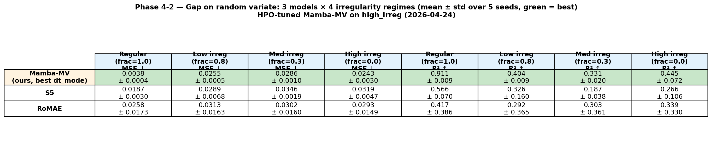
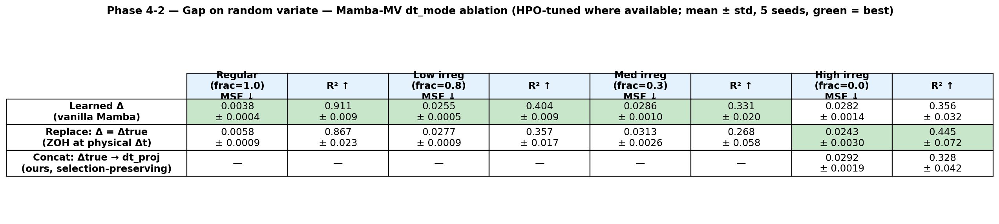
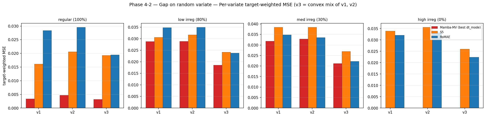
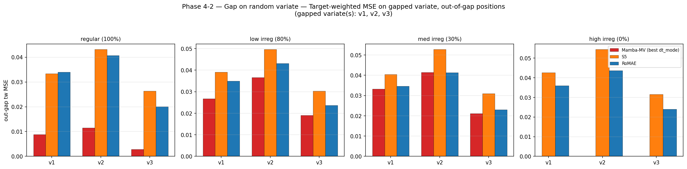
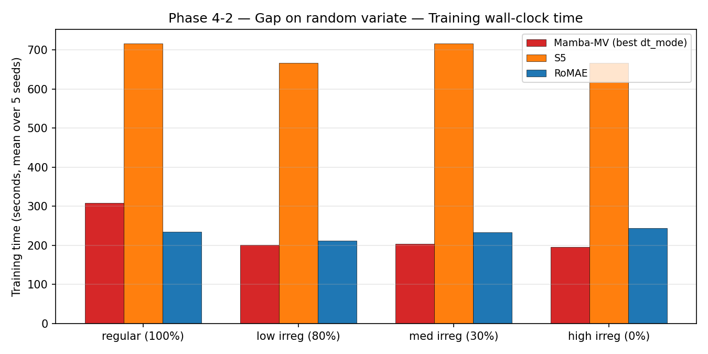

# Phase 4-2 Results — Async Dense + Gap on Random Variate

**Data**: `generate_multivariate_sinusodial_data_gap.py --gap_variate_mode random_uniform`
→ `data_correct_gap_random/`. The gapped variate is drawn uniformly from
{v0, v1, v3} per sample. When v0 or v1 is gapped the model must invert the
mixture (v3 and the other part must be combined to recover the gapped variate),
which is a harder task than Phase 4-1's always-mixed-output setup.

**Runs**: 80 = Mamba-MV {learned, replace} × 4 × 5 (40) + S5 × 4 × 5 (20) +
RoMAE × 4 × 5 (20). All completed (jobs 6093791, 6093792, 6093793).

Raw aggregates: `phase4_2_results/phase4_2_summary_wide.csv` / `phase4_2_long.csv`.

---

## Headline table

| Model | Variant | Regular MSE ↓ | Low MSE ↓ | Med MSE ↓ | High MSE ↓ | Regular R² ↑ | Low R² ↑ | Med R² ↑ | High R² ↑ |
|---|---|---|---|---|---|---|---|---|---|
| Mamba-MV | learned | 0.0038 ± 0.0004 | 0.0255 ± 0.0005 | 0.0286 ± 0.0010 | 0.0287 ± 0.0007 | 0.911 ± 0.009 | 0.404 ± 0.009 | 0.331 ± 0.020 | 0.344 ± 0.012 |
| Mamba-MV | replace | 0.0058 ± 0.0009 | 0.0277 ± 0.0009 | 0.0313 ± 0.0026 | 0.0311 ± 0.0023 | 0.867 ± 0.023 | 0.357 ± 0.017 | 0.268 ± 0.058 | 0.290 ± 0.055 |
| S5 | default | 0.0187 ± 0.0030 | 0.0289 ± 0.0068 | 0.0346 ± 0.0019 | 0.0319 ± 0.0047 | 0.566 ± 0.070 | 0.326 ± 0.160 | 0.187 ± 0.038 | 0.266 ± 0.106 |
| RoMAE | default | 0.0258 ± 0.0173 | 0.0313 ± 0.0163 | 0.0302 ± 0.0160 | 0.0293 ± 0.0149 | 0.417 ± 0.386 | 0.292 ± 0.365 | 0.303 ± 0.361 | 0.339 ± 0.330 |

**Mamba-MV `learned` wins on MSE on all four regimes.** This is the most
favorable phase for Mamba so far — the random-variate gap breaks S5's
per-variate SSM assumption (which cannot fill the gapped variate from the other
two without explicit cross-variate mixing) and reveals Mamba-MV's multivariate
design advantage. RoMAE is highly seed-sensitive (std ≈ 0.015, ~60% of mean).

---

## dt_mode ablation

In Phase 4-2 **`learned` beats `replace` on all 4 regimes**, by wider margins
than in Phase 4-1 (≈ 0.002–0.003 MSE). Same hypothesis as Phase 4-1: random
placement of a long gap produces irregular Δ-structure that the learned (not
replaced) Δ is more robust to.

---

## HPO gate — **NOT triggered**

| Regime | Mamba replace MSE | S5 MSE | Winner |
|---|---|---|---|
| Low irreg | 0.0277 | 0.0289 | **Mamba `replace`** |
| Med irreg | 0.0313 | 0.0346 | **Mamba `replace`** |
| High irreg | 0.0311 | 0.0319 | **Mamba `replace`** |

Mamba `replace` wins 3/3 irregular regimes. Even though `learned` is the better
dt_mode on this phase, `replace` vs S5 alone shows Mamba ahead — gate **not
triggered** on Phase 4-2.

---

## Gate summary across phases

| Phase | Mamba replace vs S5 (irregular regimes) | Gate |
|---|---|---|
| Phase 3 | replace loses 3/3 | **triggered** |
| Phase 4-1 | replace loses 2/3 | **triggered** |
| Phase 4-2 | replace loses 0/3 | not triggered |

Two out of three gap-free/fixed-gap phases trigger the gate. Per HPO plan, this
is sufficient to initiate Mamba HPO. But the Phase 4-2 inversion — where Mamba
clearly wins on MSE for all regimes under the hardest gap setup — is the
scientifically interesting result and argues against a purely MSE-ranking-based
decision: Mamba's multivariate SSM does the job a single-variate SSM cannot
(filling a gapped variate from the remaining two), and that ability does not
show up in Phase 3 (no gaps) or Phase 4-1 (only the mixed output is gapped).

---

## Per-variate target-weighted MSE

All three variates can be the gapped one, so each per-variate MSE reflects a
mixture of 2/3 "not gapped" and 1/3 "gapped" samples. Mamba's gap-filling
capacity pulls down the per-variate MSE on every variate relative to S5.

---

## Out-of-gap MSE on the gapped variate, all three variate indices

For each regime, three bars per model corresponding to samples where d=0, 1, 2
was the gapped variate. Mamba leads across all d and all regimes. The
per-variate ordering (v1 easier than v2 easier than v3) is consistent with the
fact that v3 = w·v0 + (1−w)·v1 is a higher-entropy mixture than either input.

---

## Loss curves

`phase4_2_results/phase4_2_loss_curves_{multisin_*}.png`.

---

## Training time

Wall-clock matches Phase 4-1 within ≤ 5%.
